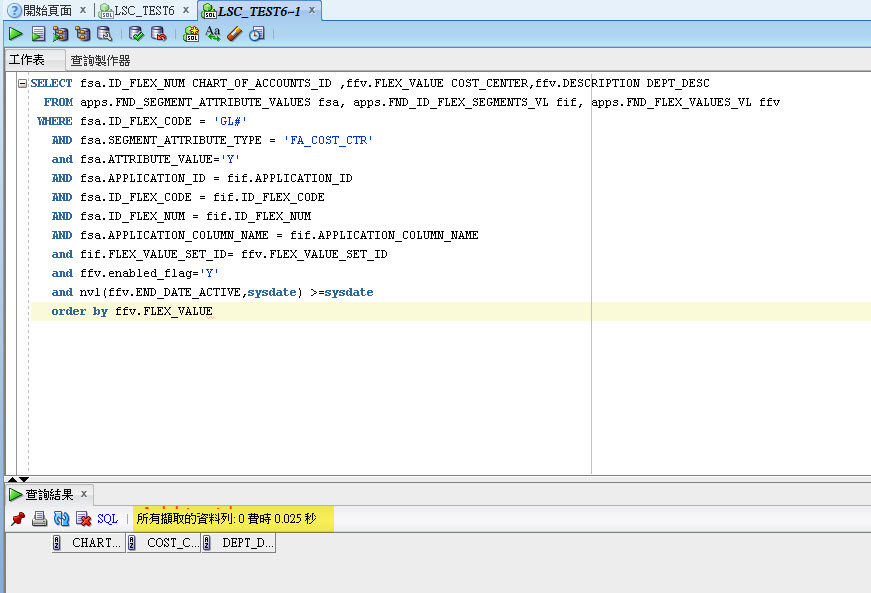
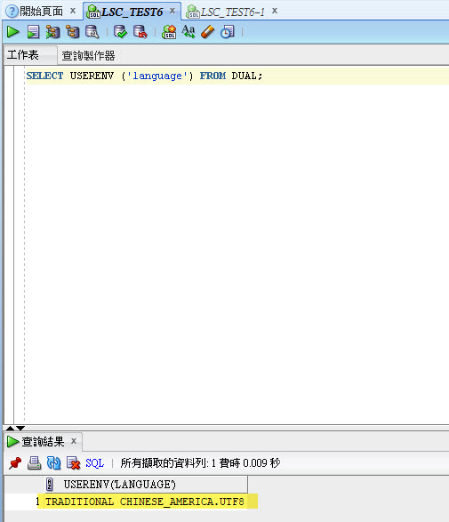
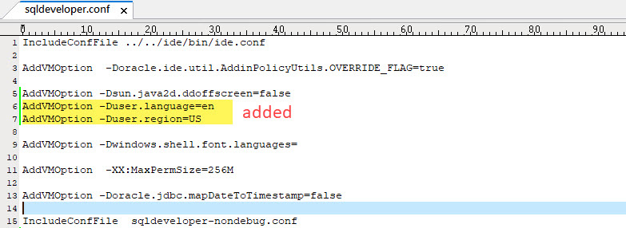
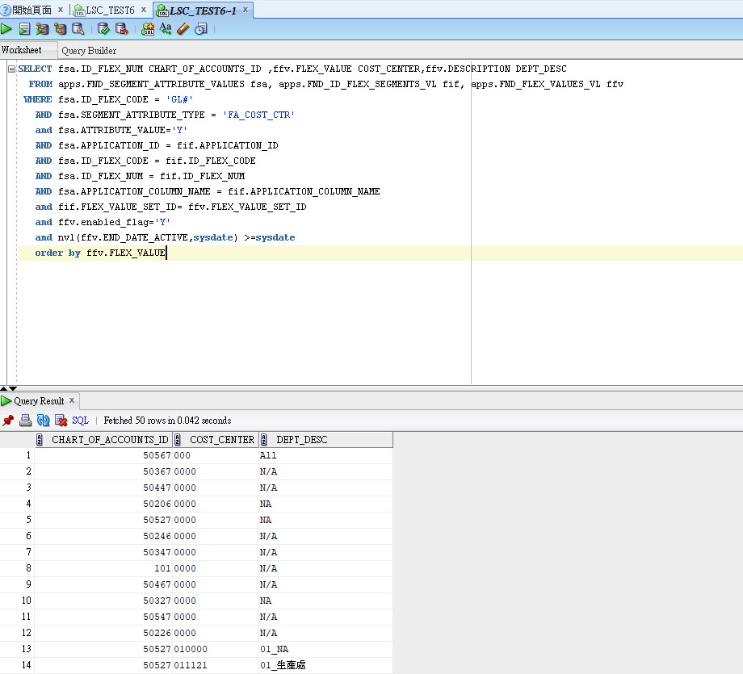

# {Issue} SQL Developer查不到Oracle ERP資料但Toad可以

> **原文資訊（自 Pixnet 遷移）**
> - 原文連結：https://somebabytina.pixnet.net/blog/posts/3049924308
> - 發布日期：2022-01-25 01:41
> - 瀏覽人數：6
> - 分類：SQL／資料庫（原：SQL Developer／職場甘苦／進修深造）
> - Oracle EBS 版本：未註明

---

<Issue Description>

同一個SQL Query當使用Toad query資料時，是可以看到Return資料的，但透過SQL Developer會query 0 rows.

<Root Cause>

Oracle EBS有很多View是要參照環境變數中的NLS_LANG設定的，而一般來說我們只會存放US語系的資料，所以如果你的環境變數語系不對，那麼Query時會一直查不到資料。
然SQL Developer不會去抓oracle Home下的NLS_LANG的設定。雖然我已經在Oracle Home的NLS_LANG設定Value為AMERICAN_AMERICA.ZHT16BIG5

<Solution>

到你的SQL Developer 執行檔目錄下 ex. C:\app\client\xxx\product\12.1.0\client_1\sqldeveloper\sqldeveloper\bin
使用文字檔編輯器開啟檔案"sqldeveloper.conf" 新增
AddVMOption -Duser.language=en
AddVMOption -Duser.region=US
記得存檔

<Result>

修改後，需要關閉SQL Developer,重新啟動
在重新查詢，就可以看到的資料了

